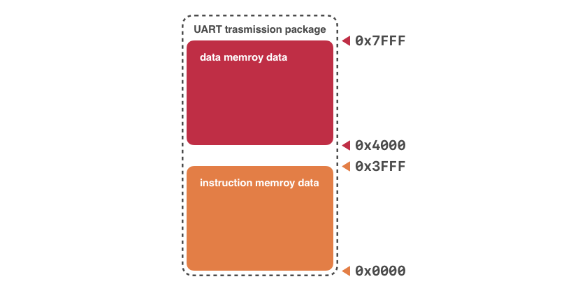

# UART Exchange Protocol

### From CPU

> Packets sent from the CPU to PC.
> 

---

`SIGNAL`: inform the PC of the signals’ values in the CPU

- Byte 1: opcode `0x01`
- Byte 2 to 5: value of current program counter (word aligned)
- Byte 6 onwards: the concatenated signals (byte aligned) and padded with 0s to fit the last byte, the PC should know how many bytes will be sent since it knows which signals are selected and the size of each signal

---

`OK`: respond to the PC’s `PING`, signaling that the COM port is active

- Byte 1: opcode `0x02`

### From PC

> Packets which the CPU will be receiving.
> 

---

`PING`: to check if the CPU is connected to a specific COM port

- Byte 1: opcode `0x03`

---

`PAUSE`: to pause the CPU, the instruction freshly fetched will be ensured to complete the entire pipeline, and no new instructions will enter the pipeline

- Byte 1: opcode `0x04`

---

`RESUME`: resume execution in the CPU until reaching the next breakpoint

- Byte 1: opcode `0x05`
- Byte 2 to 5: value of the program counter for next breakpoint (word aligned), if resuming after the last breakpoint, simply set this value to the total number of instructions provided by the user multiplied by 4, which will halt the CPU after the last instruction’s execution

---

`NEXT`: let the CPU execute the next instruction, that instruction will be guaranteed to complete the entire pipeline

- Byte 1: opcode `0x06`

---

`PROGRAM`: send the ASM file through UART to the CPU’s RAM and ROM, the ASM file should be 64K with the following memory arrangement:

ASM file memory arrangement

- Byte 1: opcode `0x07`
- Byte 2 onwards: each byte of the ASM binary file